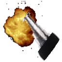

# 👈 Zeigestock Everywhere

Extension for all Chromium- and Gecko-based Web Browsers that replaces your cursor with a *Zeigestock* whereever possible.
Derived from [my websites](https://codeberg.org/haesemeyer/pages) `zeigestock.js`
*(please consider updating both this extension and the original script with each commit)*

This is extremely stupid, ~~it will download everything all of the time, requires an internet connection and if I replace the script with malicious code then that's your problem now.~~ it runs locally now, but it's still stupid.
But have you considered how fun having a *Zeigestock* literally ***everywhere*** is!?!?

Licensed under [**CC BY-SA 4.0**](./LICENSE.md)...

## Firefox

Firefox requires signing Extensions.
Either sign your copy or disable `xpinstall.signatures.required` in `about:config`
